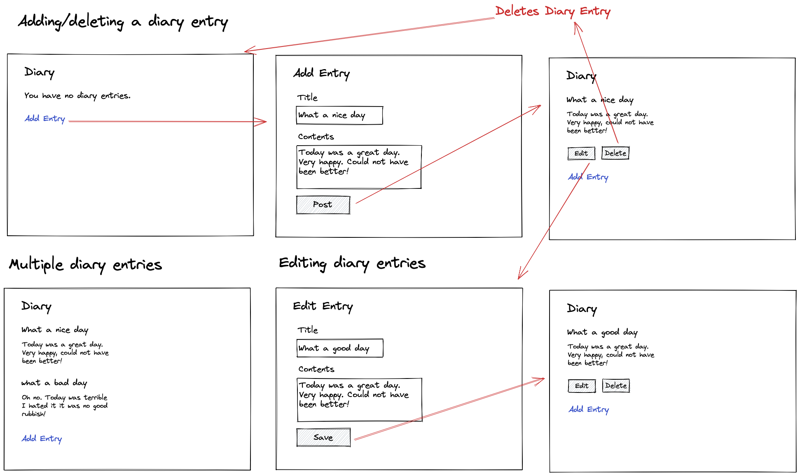

# {{PROBLEM}} Web Design Recipe (Level Two)

## 1. Describe the Problem

_Put or write the user stories here. Add any clarifying notes you might have._

Stage One
As a user
So that I can find my cat that I lost
I want to post an advert for a lost cat with some description of the cat, and my telephone number so people can contact me

As a user
So that I can help others find their lost cats
I want to see all of the lost cat adverts

Stage Two
As a user
So that I can focus on the yet not-found cats
I want to delete adverts for cats that have been found

As a user
So that I can update lost cat adverts with potential sightings
I want to update adverts

## 2. Design the Interface

_This is the fun part! Use excalidraw.com or a similar tool to design some
wireframes (rough sketches of the user interface). Include interactions and
transitions between pages — those are the most critical part._



## 3. Design the Data Model Classes

_These classes should store and manage the data the server will hold._
_Include the initializer and public methods with all parameters and return values._

```ruby
# EXAMPLE

class Board
  def initialize
  end

  def adverts
    # Returns a list of instances of advert
  end

  def add(advert) # advert is a AdvertPost
    # No return value
  end

  def get(index) # index is a number
    # Returns an advert, the advert at the given index
  def

  def update(index, number, description) # index is a number, new_advert is a AdvertPost
    # Updates the entry at index to be the new_advert
    # Update with potential sightings
    # No return value
  end

  def remove(index) # index is a number
    # Deletes the advert at index
  end

  def update_list
    # removes all found cats from the list 
    # returns list 
  end

end

class AdvertPost
  def initialize(number, description)
    # number is a integer
    # description is a string
    # initalise varialve @found = false
  end

  def number
    # Returns the number
  end

  def description
    # Returns the description
  end

  def found? 
    # Return @found
  end

  def been_found
    # Covert @found from flase to true
  end
end
```

_Check them against these rules:_

> 1. Does they represent a collection or collections of data?
> 2. Does each collection have relevant methods to:
>    1. List out all items in the resource
>    2. Create an item (C)
>    3. Get a single item (R)
>    4. Update an item (U)
>    5. Delete an item (D)
> 3. Is it possible to construct a realistic data model just by using simple
>    data types? (strings, integers, booleans)
> 
> This is OK:
> ```ruby
> diary = Diary.new
> entry = DiaryEntry.new("Title", "Contents")
> diary.add(entry)
> # Ultimately only two strings enter the data model.
> ```
> 
> This is not:
> ```ruby
> diary = Diary.new
> entry = DiaryEntry.new("Title", ["Comment One", "Comment Two"])
> diary.add(entry)
> # In this case, a string and a list of strings enter the data model.
> # A list isn't a simple enough data type.
> ```
> 
> The reason for this is that we will be moving onto databases. Databases
> typically can only store simple data types, so we're keeping that discipline
> for now!
> 
> Some of these rules will be relaxed later but will keep you safe for now.

## 4. Design the Web API (Requests)

_Design requests that perform each of the key operations on your data model._
_Map them to the methods or code snippets in your data model._

```ruby
# EXAMPLE

INDEX
Request: GET /board
board.adverts

CREATE
POST /board
With data: { number: "07364843763", description: "Ginger cat" }
advert = AdvertPost.new(number, description)
board.add(advert)

 READ
 GET /board/:index
board.get(index)

UPDATE
PATCH /board/:index
With data: { number: "07364843763", description: "Ginger cat" }
advert = AdvertPost.new(number, description)
board.update(index, advert)

DELETE
DELETE /board/:index
board.remove(index)
```

> Remember:
> GET: Getting a single item or a list of items
> POST: Adding an item
> PATCH: Updating an item
> DELETE: Deleting an item

## 5. Create Examples of User Interactions

_Create examples of user interactions and expectations._

```ruby
# As you learn the testing tools you might start writing with realistic test
# code here, but at the start it's OK if it's just English or made up code.

# View no entries
visit "/board"
# User sees: You have no board adverts.

# Interaction testing

# 1. Add an advert
visit "/board
click link "Add Advert"
enter "07364843763" into "number" field
enter "Ginger cat" into "description" field
click button "Post"
# User sees in the advert list:
# 07364843763
# Ginger cat

# 2. Multiple adverts
visit "/board"
click link "Add Advert"
enter "07364843763" into "number" field
enter "Ginger cat" into "description" field
click button "Post"
click link "Add Advert"
enter "07364843766" into "number" field
enter "Black cat" into "description" field
click button "Post"
# User sees in the advert list:
# 07364843763
# Ginger cat
# 07364843766
# Black cat

# 3. Multiple adverts and delete an advert

visit "/board"
click link "Add Advert"
enter "07364843763" into "number" field
enter "Ginger cat" into "description" field
click button "Post"
click link "Add Advert"
enter "07364843766" into "number" field
enter "Black cat" into "description" field
click button "Post"
click link "Remove Advert"
enter "1" into "index" field
# User sees in the advert list:
# 07364843766
# Black cat

# 4. Add multiple adverts and add an update at the index

visit "/board"
click link "Add Advert"
enter "07364843763" into "number" field
enter "Ginger cat" into "description" field
click button "Post"
click link "Add Advert"
enter "07364843766" into "number" field
enter "Black cat" into "description" field
click button "Post"

click link "Update button"
enter "1" into "index" field
enter "07364843799" into "number" field
enter "White cat" into "description" field
click button "Post"

# User sees in the advert list:
# 07364843799
# White cat
# 07364843766
# Black cat

# 5. Add multiple adverts, mark some as found and update list

visit "/board"
click link "Add Advert"
enter "07364843763" into "number" field
enter "Ginger cat" into "description" field
click button "Post"
click link "Add Advert"
enter "07364843766" into "number" field
enter "Black cat" into "description" field
click button "Post"
click link "Add Advert"
enter "07364843799" into "number" field
enter "White cat" into "description" field
click button "Post"
click link "Found"
enter "2" into " Index" field
click button "Post"
click button "Update list"

# User sees in the advert list:
# 07364843763
# Ginger cat
# 07364843799
# White cat


# 6. 

# Unit Testing 
# 1. return number

# 2. return description

# 3. return found?

# 4. Update been_found, return found

```

## 6. Test-Drive the Behaviour

_Follow this cycle:_

1. Add a feature test in `/spec/feature/` (RED)
2. Implement the behaviour in `app.rb`
3. Does it pass without data model changes? (GREEN) Then skip to step 6.
4. Otherwise, add a unit test for the data model to `/spec/unit` (RED)
5. Implement the behaviour in your data model class. (GREEN)
6. Apply any refactors to improve the structure of the code. (REFACTOR)  
   Run `rubocop` as part of this.
7. Go back to step 1.


<!-- BEGIN GENERATED SECTION DO NOT EDIT -->

---

**How was this resource?**  
[😫](https://airtable.com/shrUJ3t7KLMqVRFKR?prefill_Repository=makersacademy/web-starter-level-two&prefill_File=recipe/recipe.md&prefill_Sentiment=😫) [😕](https://airtable.com/shrUJ3t7KLMqVRFKR?prefill_Repository=makersacademy/web-starter-level-two&prefill_File=recipe/recipe.md&prefill_Sentiment=😕) [😐](https://airtable.com/shrUJ3t7KLMqVRFKR?prefill_Repository=makersacademy/web-starter-level-two&prefill_File=recipe/recipe.md&prefill_Sentiment=😐) [🙂](https://airtable.com/shrUJ3t7KLMqVRFKR?prefill_Repository=makersacademy/web-starter-level-two&prefill_File=recipe/recipe.md&prefill_Sentiment=🙂) [😀](https://airtable.com/shrUJ3t7KLMqVRFKR?prefill_Repository=makersacademy/web-starter-level-two&prefill_File=recipe/recipe.md&prefill_Sentiment=😀)  
Click an emoji to tell us.

<!-- END GENERATED SECTION DO NOT EDIT -->
